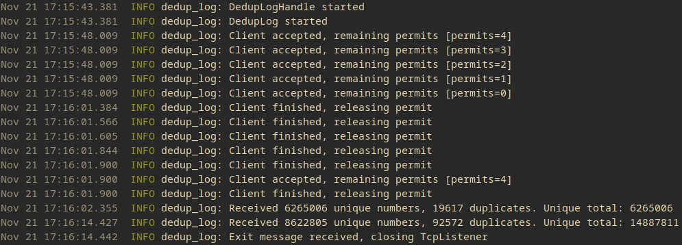

This is a demo project to play around with channels, semaphores and signals to handle a limited amount of concurrent clients appending
messages to a centralized data structure as fast as possible.

More specifically, using the default values, the binary will listen to at most 5 concurrent clients on TCP/IP port 4000 and write
**validated messages** in a **deduplicated log**. Every 10 seconds a status report is printed with the count of unique and duplicated
messages received in the last 10 seconds period. Upon termination, the server **gracefully shutdowns** processing all enqueued messages and
printing the last status report before exiting.



## How to try it

To run the tests:

```shell
$ cargo test
```

To run the server, build the binary in release mode:

```shell
$ cargo build --release
```

and execute it:

```shell
$ ./target/release/dedup-log
```

Now you can run one of the clients from the `examples` directory:

```shell
$ cargo run --example client_concurrent
```

## Config

To change the parameters used by the binary, copy the `config.toml.sample` file as `config.toml` and modify it as desired.
